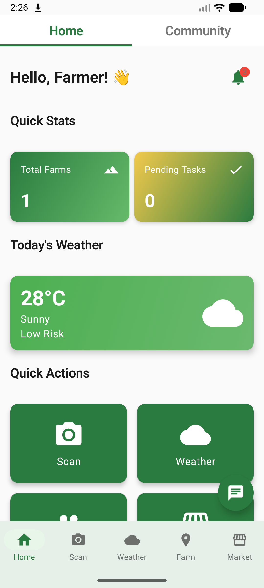
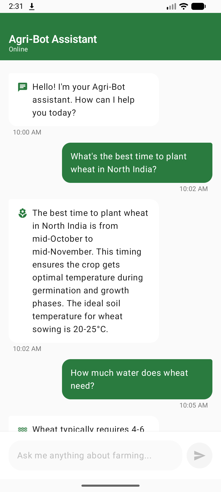
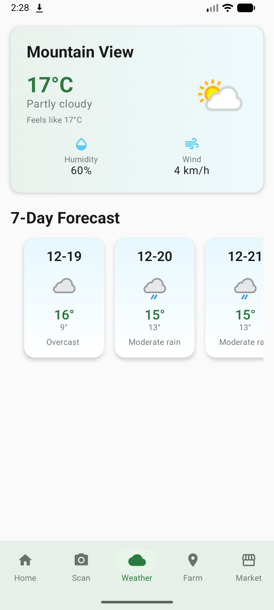
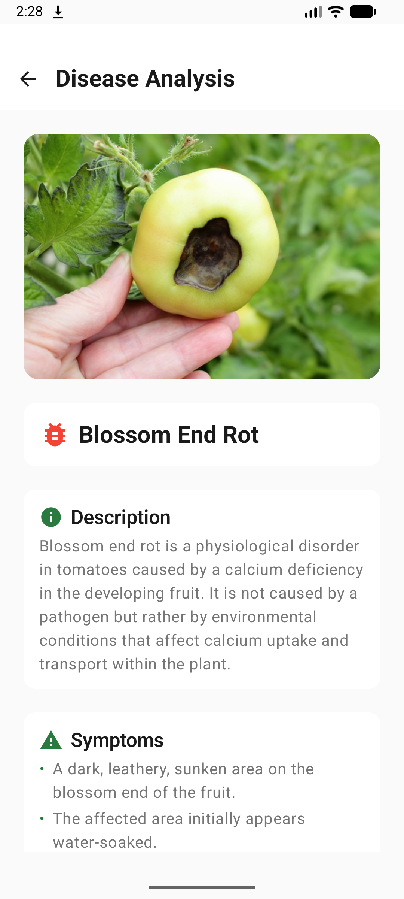

# 🌾 AgroHub - Smart Agriculture Management Platform

<div align="center">


[](https://www.android.com/)
[](https://kotlinlang.org/)
[](https://developer.android.com/jetpack/compose)
[](LICENSE)

**A comprehensive Android application empowering farmers with AI-driven insights, real-time weather updates, and smart field management.**

[Features](#-features) • [Screenshots](#-screenshots) • [Tech Stack](#-tech-stack) • [Getting Started](#-getting-started) • [Architecture](#-architecture) • [Contributing](#-contributing)

</div>

---

## 📋 Overview

AgroHub is a modern Android application designed to revolutionize farming practices by providing farmers with intelligent tools for crop management, disease detection, weather monitoring, and community engagement. Built with cutting-edge technologies including Jetpack Compose, Google Maps, and Gemini AI, AgroHub brings the power of technology to agriculture.

## ✨ Features

### 🏠 **Smart Dashboard**
- Real-time farm statistics and crop health monitoring
- Quick access to essential farming tools
- Weather warnings and alerts
- Interactive farm overview with visual insights

### 🤖 **AI-Powered Agriculture Assistant**
- Powered by Google Gemini AI
- Expert advice on crop management, pest control, and soil health
- Natural language conversations about farming queries
- Context-aware responses tailored to agriculture

### 🗺️ **Interactive Field Mapping**
- Google Maps integration for field visualization
- Mark and track multiple farm locations
- Hybrid satellite view for detailed field analysis
- GPS-based field boundary tracking

### 🌤️ **Weather Intelligence**
- Real-time weather forecasts
- Risk level assessments for farming activities
- Temperature, humidity, and precipitation tracking
- Weather-based farming recommendations

### 🔬 **Disease Detection**
- AI-powered crop disease identification
- Camera-based plant health analysis
- Treatment recommendations
- Disease prevention tips

### 🛒 **Marketplace**
- Buy and sell agricultural products
- Connect with suppliers and buyers
- Product listings with detailed information
- Secure transaction support

### 👥 **Community Hub**
- Connect with fellow farmers
- Share experiences and best practices
- Community discussions and forums
- Knowledge sharing platform

### 📊 **Farm Management**
- Track multiple farms and fields
- Crop status monitoring
- Task management and reminders
- Historical data and analytics

## 📱 Screenshots

<div align="center">

| Home Screen | Field Map | AI Assistant |
|------------|-----------|--------------|
|  |  |  |

| Weather | Disease Detection |
|---------|------------------|
|  |  |

</div>
[](https://youtu.be/phoPuOGwV9E)

## 🛠️ Tech Stack

### **Core Technologies**
- **Language:** Kotlin 2.0.21
- **UI Framework:** Jetpack Compose (Material 3)
- **Architecture:** MVVM with Clean Architecture principles
- **Minimum SDK:** 24 (Android 7.0)
- **Target SDK:** 36

### **Key Libraries & APIs**

| Category | Technology |
|----------|-----------|
| **AI & ML** | Google Gemini AI (generativeai 0.9.0) |
| **Maps** | Google Maps SDK for Android, Maps Compose |
| **Navigation** | Jetpack Navigation Compose |
| **Image Loading** | Coil Compose |
| **Permissions** | Accompanist Permissions |
| **Testing** | Kotest, JUnit, Espresso |
| **Build System** | Gradle (Kotlin DSL) |

## 🚀 Getting Started

### Prerequisites

- Android Studio Hedgehog (2023.1.1) or later
- JDK 11 or higher
- Android SDK 24+
- Google Maps API Key
- Gemini AI API Key

### Installation

1. **Clone the repository**
   ```bash
   git clone https://github.com/yourusername/agrohub.git
   cd agrohub
   ```

2. **Set up API Keys**
   
   Copy the template file:
   ```bash
   cp local.properties.template local.properties
   ```
   
   Edit `local.properties` and add your API keys:
   ```properties
   GOOGLE_MAPS_API_KEY=your_google_maps_api_key_here
   GEMINI_API_KEY=your_gemini_api_key_here
   ```

3. **Get API Keys**
   
   - **Google Maps API Key:** [Get it here](https://console.cloud.google.com/)
     - Enable "Maps SDK for Android"
     - Restrict key to your app's package name and SHA-1
   
   - **Gemini AI API Key:** [Get it here](https://aistudio.google.com/app/apikey)
     - Free tier available with generous limits

4. **Build and Run**
   ```bash
   ./gradlew assembleDebug
   ```
   
   Or open the project in Android Studio and click Run ▶️

### Configuration

The app uses `local.properties` for secure API key management. This file is automatically ignored by Git to protect your credentials.

For detailed setup instructions, see:
- [API Keys Security Guide](API_KEYS_SECURITY_GUIDE.md)
- [Gemini AI Setup](GEMINI_API_SETUP.md)

## 🏗️ Architecture

AgroHub follows Clean Architecture principles with MVVM pattern:

```
app/
├── data/                    # Data layer
│   ├── models/             # Data models
│   └── repositories/       # Data repositories
├── domain/                  # Business logic layer
│   └── usecases/           # Use cases
├── ui/                      # Presentation layer
│   ├── screens/            # Screen composables
│   ├── components/         # Reusable UI components
│   ├── navigation/         # Navigation setup
│   ├── theme/              # App theming
│   └── icons/              # Custom icons
└── services/               # External services (AI, APIs)
```

### Design System

AgroHub uses a custom design system with:
- **Color Palette:** Agriculture-inspired greens and earth tones
- **Typography:** Clear, readable fonts optimized for outdoor use
- **Components:** Reusable, accessible UI components
- **Icons:** Custom agricultural icon set

## 🧪 Testing

Run tests with:

```bash
# Unit tests
./gradlew test

# Instrumented tests
./gradlew connectedAndroidTest
```

The project includes:
- Unit tests with Kotest
- Property-based testing
- UI tests with Compose Testing
- Integration tests

## 📦 Build Variants

- **Debug:** Development build with debugging enabled
- **Release:** Production build with ProGuard optimization

## 🤝 Contributing

We welcome contributions! Here's how you can help:

1. Fork the repository
2. Create a feature branch (`git checkout -b feature/AmazingFeature`)
3. Commit your changes (`git commit -m 'Add some AmazingFeature'`)
4. Push to the branch (`git push origin feature/AmazingFeature`)
5. Open a Pull Request

Please read [CONTRIBUTING.md](CONTRIBUTING.md) for details on our code of conduct and development process.

## 📄 License

This project is licensed under the MIT License - see the [LICENSE](LICENSE) file for details.

## 🙏 Acknowledgments

- Google Gemini AI for powering the intelligent assistant
- Google Maps Platform for mapping capabilities
- The Android and Jetpack Compose teams for excellent tools
- The open-source community for inspiration and support

## 📞 Contact & Support

- **Issues:** [GitHub Issues](https://github.com/SteveRogersBD/Agrohub/issues)
- **Discussions:** [GitHub Discussions](https://github.com/SteveRogersBD/Agrohub/discussions)
- **Email:** cd43641@truman.edu


## 📊 Project Status


---

<div align="center">

**Made with ❤️ for farmers worldwide**

⭐ Star this repo if you find it helpful!

[Report Bug](https://github.com/SteveRogersBD/Agrohub/issues) • [Request Feature](https://github.com/SteveRogersBD/Agrohub/issues)

</div>
